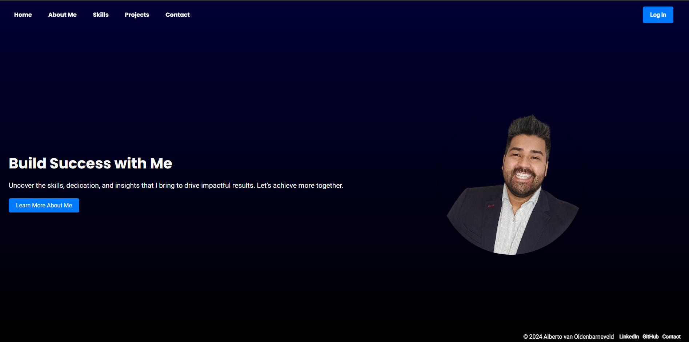
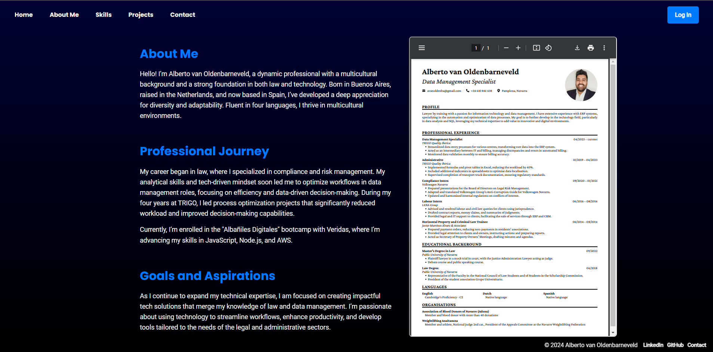
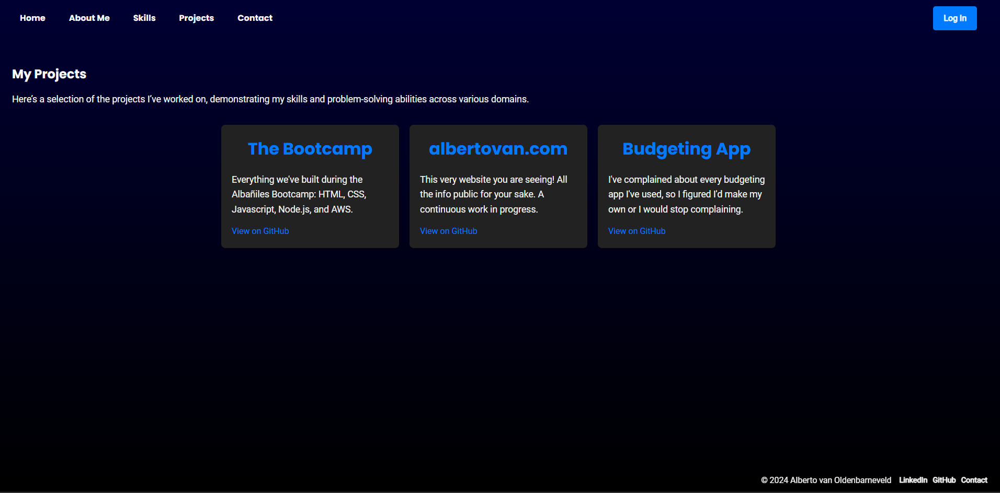
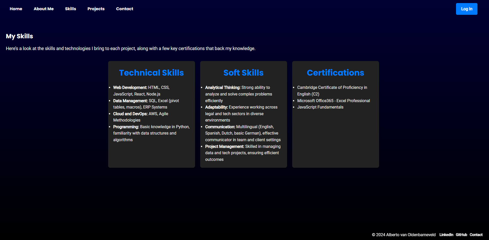
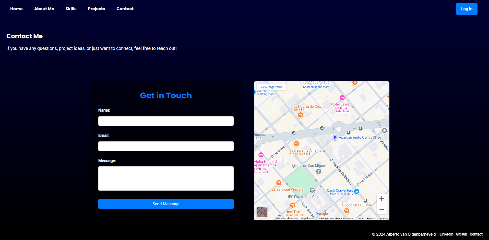
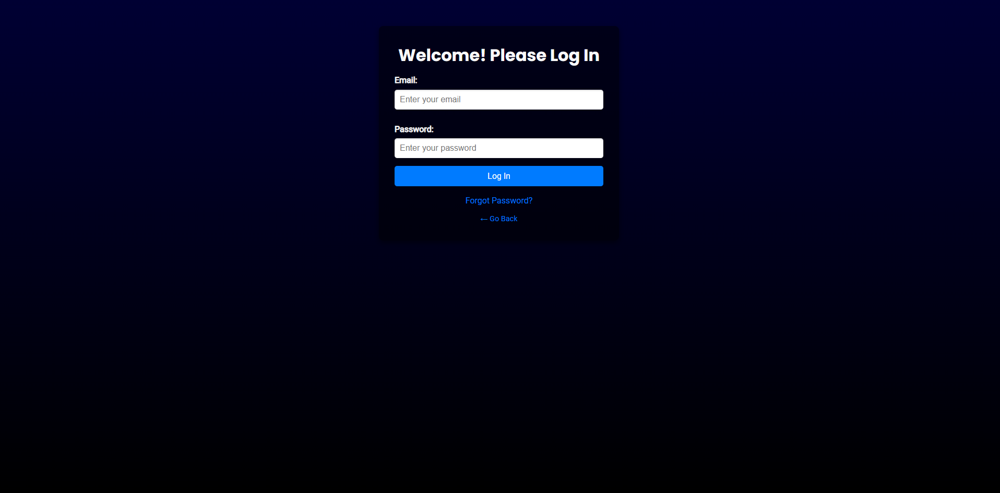
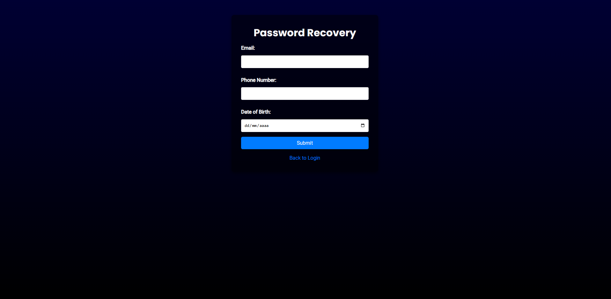

# Final Project: HTML & CSS

## 📌 Description
This project is a **fully responsive personal portfolio website** built using **HTML and CSS** as part of the final assignment for the HTML & CSS module. It includes multiple sections such as an about page, projects, skills, and a contact form, following structured best practices.

## 🚀 Features

## 📸 Screenshots

### 1️⃣ Home Page


### 2️⃣ About Page


### 3️⃣ Projects Page


### 4️⃣ Skills Page


### 5️⃣ Contact Page


### 6️⃣ Login Page


### 7️⃣ Password Recovery Page


## 📄 Page Descriptions

1. **Home Page** (`index.html`)
   - Serves as the landing page with an introduction.
   - Navigation bar to access all sections of the website.
   - Smooth hover transitions and animations.

2. **About Page** (`about.html`)
   - Provides a brief introduction about the user.
   - Includes profile information and professional background.

3. **Projects Page** (`projects.html`)
   - Showcases completed projects with descriptions.
   - Uses a clean layout to present work samples.

4. **Skills Page** (`skills.html`)
   - Displays relevant technical and soft skills.
   - Includes visual representation of skill levels.

5. **Contact Page** (`contact.html`)
   - Provides a contact form for user inquiries.
   - Embeds a **Google Maps/OpenStreetMaps** location.

6. **Login Page** (`index.html`)
   - Allows users to enter login credentials.
   - Includes form validation.

7. **Password Recovery Page** (`password-recovery.html`)
   - Provides an option to reset passwords.
   - Additional security inputs (email, phone, birthdate).

## 🎨 Styling & UX Features
- **CSS animations and transitions** for a modern feel.
- **Media queries** for a fully responsive design across devices.
- **Consistent navigation bar** across all pages.
- **Hover effects** on interactive elements.
- **Favicon** included for branding.

## 📂 File Structure
```
/Project Root
│── index.html          # Main landing page
│── about.html          # About section
│── projects.html       # Projects showcase
│── skills.html         # Skills overview
│── contact.html        # Contact form
│── password-recovery.html # Password recovery page
│
├── /css                # Contains all CSS stylesheets
│   ├── styles.css
│
├── /img                # Stores profile images and icons
│   ├── Alberto.png
│   ├── favicon.ico
│
├── /Screenshots        # Stores project screenshots
│
├── /files              # Stores downloadable files (e.g., CV)
│   ├── Alberto_van_Oldenbarneveld_CV.pdf
│
└── Informe.pdf         # Project documentation
```

## 👅 Installation & Usage
1. **Extract the ZIP file** containing the project.
2. **Open `index.html` in a browser** to navigate through the website.
3. Use the navigation menu to explore different sections.

## 📌 Notes
- This is a **static project** (no backend functionality).
- Demonstrates **HTML & CSS best practices**, ensuring accessibility and responsiveness.
- Includes **well-organized code and file structure** for easy maintainability.

