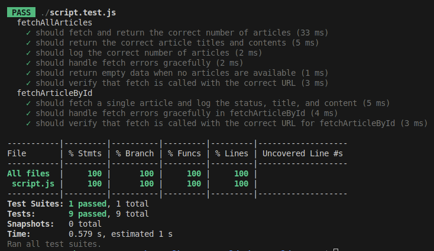

# Project: fetchAllArticles & fetchArticleById

## 📌 Description
This project contains two main functions to fetch articles from an API:
1. **`fetchAllArticles`**: Fetches and displays all articles, including the total count and a table with titles and contents.
2. **`fetchArticleById(id)`**: Fetches a specific article by ID and logs its status, title, and content.

Includes **unit tests with Jest** to verify correct behavior and error handling.

## 🛠️ Technologies Used
- **JavaScript** → Asynchronous API calls with `fetch`.
- **Jest** → Unit testing framework.
- **ESLint** → Enforces code style best practices.

## 📥 Installation
1. Extract the project folder.
2. Install dependencies:
   ```bash
   npm install
   ```

## 🏃 Usage
### **Run the Script**
```bash
node exercise11.js
```
### **Run Tests with Jest**
```bash
npm test
```
### **Generate Coverage Report**
```bash
jest . -- --coverage
```

## 📊 Test Coverage
The test suite achieves **100% coverage** in all categories:
- **Statements**: 100%
- **Branches**: 100%
- **Functions**: 100%
- **Lines**: 100%

### 📸 Test Coverage Screenshot


## 📌 Notes
- Uses **mocked fetch requests** in Jest tests.
- Verifies API calls are made with the correct URLs.
- Handles edge cases such as **empty responses and API failures**.
- Tests are designed to work in a separate folder, as long as Jest is installed globally or in a parent directory.
- Jest is included as a **devDependency** in `package.json` to ensure it runs without additional configurations.

