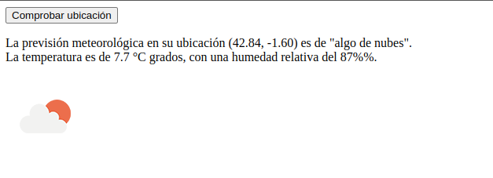

# Final Project: JavaScript & OpenWeather API

## 📌 Description
This project is a **JavaScript-based weather forecast application** that retrieves real-time weather data using the **OpenWeather API**. The application dynamically updates the page using **AJAX** without requiring a refresh. The primary goal of this project is to practice working with **asynchronous JavaScript, API calls, and DOM manipulation**.

## 📸 Screenshot


## 🚀 Features
- **Real-time Weather Data**: Fetches live weather updates based on the user's location.
- **Geolocation API Integration**: Automatically retrieves the user's coordinates (latitude and longitude).
- **AJAX & Fetch API**: Fetches data asynchronously without reloading the page.
- **Dynamic DOM Manipulation**: Updates weather details in real-time.
- **Error Handling**: Displays alerts if geolocation fails or API requests encounter errors.
- **Responsive UI**: Ensures a smooth user experience on different devices.

## 📂 File Structure
```
/Project Root
│── elTiempo.html       # Main UI structure
│── miScriptMeteorologico.js  # JavaScript logic for API requests & DOM manipulation
│── Screenshot.png      # Screenshot of the weather app
│
├── /img               # Stores UI-related images/icons
│   ├── 01d@2x.png
│   ├── 01n@2x.png
│   ├── 02d@2x.png
│   ├── 02n@2x.png
│   ├── ...
│   └── 50n@2x.png
```

## 📥 Installation & Setup
1. **Extract the ZIP file** containing the project.
2. **Open `elTiempo.html` in a browser** to access the application.
3. **Ensure an internet connection** for fetching weather data.

## 🌍 How It Works
1. The **Geolocation API** retrieves the user’s latitude and longitude.
2. These coordinates are used to **fetch weather data** from the OpenWeather API.
3. The **fetched data** (temperature, humidity, weather conditions) is dynamically **inserted into the DOM**.
4. If **geolocation is blocked** or fails, an **error message** is displayed.

## 📌 Example Output
A typical response displayed in the app:
```
Weather forecast in your location (Lat: 40.4168, Lon: -3.7038): Partly Cloudy
Temperature: 20°C
Humidity: 65%
```

## ⚠️ Notes
- Requires an **OpenWeather API key** (credentials provided by the instructor).
- Geolocation must be **enabled** in the browser.
- The project is purely **frontend-based** and does not store any user data.

🚀 **Enjoy coding & exploring JavaScript APIs!**

