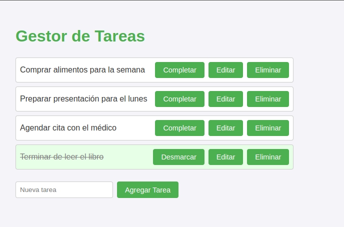

# Task Manager - Node.js Project

## 📌 Description

This project is a **basic task management application** built with **Node.js**. It enables users to manage tasks through a simple JSON-based storage system. The project does **not** use Express or other frameworks, relying on core Node.js modules for handling HTTP requests and file system interactions.

## 📸 Screenshot




## 🚀 Features

- **Task Creation & Management**: Users can add, update, and delete tasks.
- **JSON Storage**: All tasks are saved in a `tasks.json` file.
- **Basic HTTP Server**: Serves tasks without using Express.
- **Minimal Dependencies**: Uses only core Node.js modules.
- **Toast Notifications**: Provides quick visual feedback.

## 📚 File Structure

```
/Project Root
│── /public              # Static frontend files (if applicable)
│── server.js            # Main Node.js server file
│── tasks.json           # Stores tasks as JSON
│── package.json         # Project dependencies
│── LICENSE              # Project license
│── README.md            # Project documentation
│── Screenshot.png       # Screenshot of the UI
```

## 📝 Installation & Setup

1. **Extract the ZIP file** containing the project.
2. **Install dependencies** using:
   ```bash
   npm install
   ```
3. **Run the server**:
   ```bash
   npm start
   ```
4. Access the application in the browser:
   ```
   http://localhost:3000
   ```

## ⚠️ Notes

- Ensure **Node.js v16+** is installed.
- The server runs without Express, handling requests with `http` and `fs` modules.
- Tasks are stored in `tasks.json` instead of a database.

