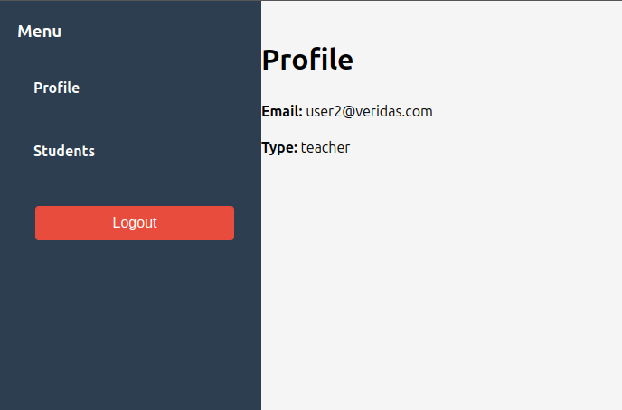

# React Authentication Project

## 📌 Overview

This is a **React-based authentication system** that allows users to log in, manage their profiles, and access different views based on their roles. The project includes role-based navigation, localStorage token management, and protected routes.

---

## 📂 Repository Structure

```
📦 project-name
 ┣ 📂 react-auth (Frontend)
 ┃ ┣ 📂 src
 ┃ ┃ ┣ 📂 components
 ┃ ┃ ┣ 📂 pages
 ┃ ┃ ┣ 📜 index.js
 ┃ ┃ ┣ 📜 App.js
 ┣ 📂 express_project_http (Backend)
 ┃ ┣ 📂 models
 ┃ ┣ 📂 routes
 ┃ ┣ 📂 controllers
 ┃ ┣ 📜 app_http.js
```

---

## 🚀 Features

- **JWT Authentication** with login/logout functionality
- **Role-Based Access** (Admin, Teacher, Student)
- **Profile Page** displaying user data
- **Users Management** (Admins can view all users)
- **Students Management** (Teachers can manage their students)
- **Protected Routes** using React Router
- **Token Management** stored in **localStorage**

---

## 🏗️ Functionality Breakdown

### 🔑 Authentication

- Users authenticate via a login form.
- JWT tokens are requested from the backend and stored in **localStorage**.
- The user’s session persists across page reloads.

### 📌 Role-Based Views

- **Admin Role**:
  - Can access all users via `/users`.
  - Can delete users.
  - Can create new users & teachers.
- **Teacher Role**:
  - Can access `/students` to see their assigned students.
  - Can add new students.
  - Can delete students.
- **General Users**:
  - Can view their profile and logout.

### ⚡ Additional Features

- Uses **React Router** for navigation.
- API requests handled in `services/` folder.
- Styled UI with a clean layout.

---

## 📸 Screenshots

- **Login Page**: 
- **User Profile**: 
- **Admin Dashboard**: 
- **Teacher's Students View**: 

---

## Installation & Setup

### **1. Install dependencies**

#### Frontend

```bash
cd react-auth
npm install
```

#### Backend

```bash
cd express_project_http
npm install
```

### Run the backend

```bash
cd express_project_http
docker compose -f docker/dev/docker-compose.services.yml up -d
npx sequelize-cli db:migrate
npx sequelize-cli db:seed:all
npm run start-http
```

### Run the frontend

```bash
cd react-auth
npm run dev
```

---

## 🏗️ User Credentials

| Role    | Email               | Password |
| ------- | ------------------- | -------- |
| Admin   | `user1@veridas.com` | `1234`   |
| Teacher | `user2@veridas.com` | `5678`   |

---

## 🔧 Corrections & Improvements

✔ **Token now stores user information properly** (`jwtDecode(token).user` in **AuthContext**).  
✔ **Corrected `role` to `type`** (`const type = decoded.type`).  
✔ **Fixed dashboard user display** (`user.email` instead of `user.username`).  
✔ **Fixed Sidebar menu visibility issues** in **CSS**.  
✔ **Implemented `Outlet` for nested routes** in `Layout.jsx`.  
✔ **API calls now correctly include `Authorization` header** (`fetchWithAuth()`).  
✔ **Fixed incorrect API paths** (`/api/user`, `/api/student`, etc.).  
✔ **Corrected `.map()` usage in Users view** (`users.map()` instead of `user.map()`).

---

## 🚀 How to Run the Project

1. **Clone the repository**:
   ```bash
   git clone https://github.com/albertusdixit/react-auth-project.git
   cd react-auth-project
   ```
2. **Install dependencies**:
   ```bash
   npm install
   ```
3. **Setup the database**:
   ```bash
   npm run setup
   ```
4. **Run the application**:
   ```bash
   npm start
   ```

---

## 🛠️ Technologies Used

- **React.js**
- **React Router**
- **JWT Authentication**
- **LocalStorage for token storage**
- **Styled Components / CSS Modules**

💡 Contributions and feedback are welcome!

